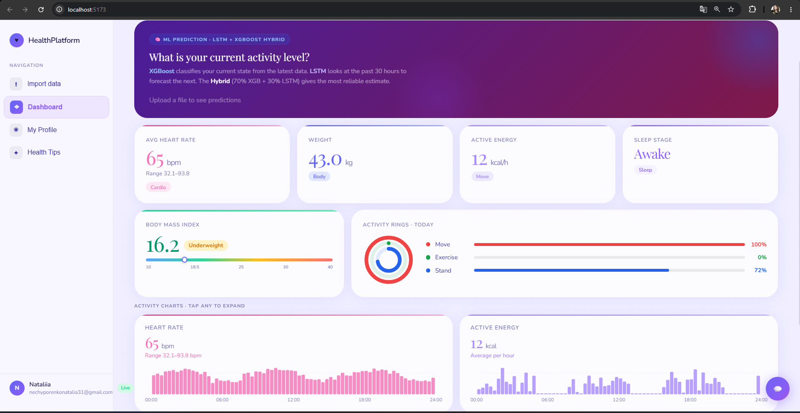
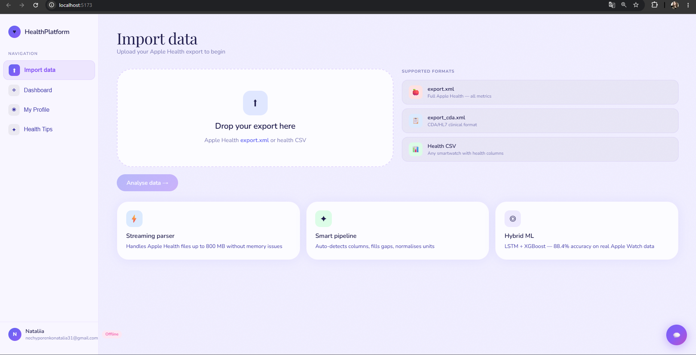
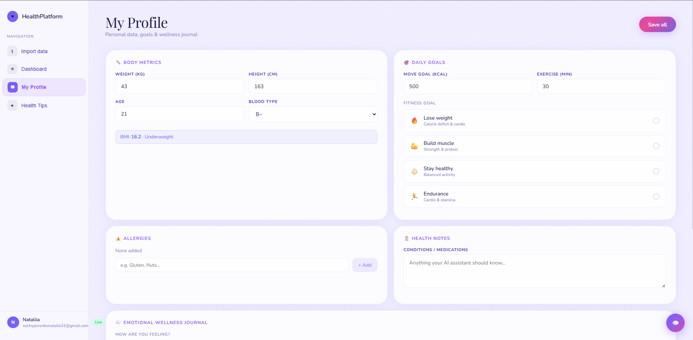
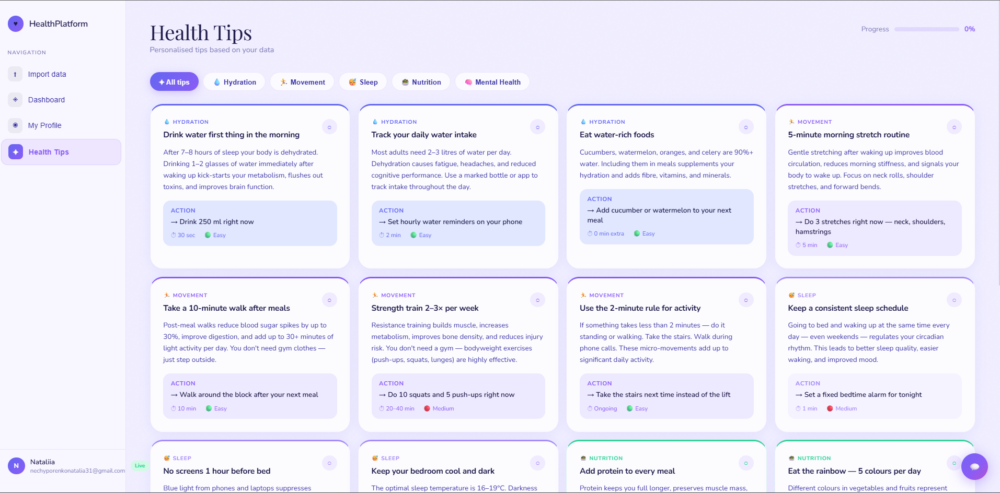
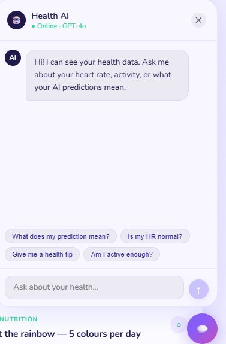

# HealthPlatform 🫀

> **Intelligent health analytics from your Apple Watch — powered by LSTM + XGBoost + GPT-4o**


HealthPlatform is a full-stack AI health analytics application that ingests personal wearable data from Apple Watch, processes it through a multi-stage machine learning pipeline, and delivers personalised insights through an interactive Bento Grid dashboard and a GPT-4o conversational assistant.

---

## ✨ Features

| Feature | Description |
|---|---|
| 📱 **Apple Health parser** | Streaming XML parser handles `export.xml` files up to 800 MB without memory issues |
| 🔄 **Universal pipeline** | Auto-detects columns from any health CSV via fuzzy matching (SequenceMatcher ≥ 75%) |
| 🤖 **Hybrid ML model** | Bidirectional LSTM + XGBoost ensemble — **88.4% accuracy** on real Apple Watch data |
| 🛡️ **Data validation** | 4-layer validation system with Trust Score (0–1) blocks bad data before prediction |
| 💬 **GPT-4o assistant** | Health context + mood journal injected into LLM for personalised conversational advice |
| 📊 **Bento Grid dashboard** | Glassmorphism UI with expandable bar charts, Activity Rings, BMI scale, and insights |
| 👤 **User profile** | Body metrics, fitness goals, allergies, emotional wellness journal |
| 💡 **Health Tips** | 15 personalised tips across 5 categories with completion tracking |
| 🔐 **JWT auth** | Secure login with bcrypt passwords and 7-day token sessions |

---

## 🖥️ Screenshots

> Dashboard · Import · Profile · Health Tips






---

## 🏗️ Architecture

```
HealthPlatform/
├── app/
│   ├── api/
│   │   └── routes/
│   │       ├── upload.py       # File ingestion + 4-layer validation
│   │       ├── predict.py      # ML inference with trust score gate
│   │       ├── analysis.py     # Stats + chart data endpoint
│   │       ├── chat.py         # GPT-4o with health context injection
│   │       └── auth.py         # JWT register / login / change password
│   ├── core/
│   │   ├── parser.py           # Streaming Apple Health XML parser
│   │   ├── universal_data_pipeline.py  # Schema detect + feature engineer
│   │   └── data_validator.py   # Trust Score validation system
│   ├── models/
│   │   ├── lstm_model.py       # Bidirectional LSTM (TensorFlow/Keras)
│   │   ├── xgb_model.py        # XGBoost classifier
│   │   └── hybrid_model.py     # 70% XGB + 30% LSTM ensemble
│   └── services/
│       ├── auth_service.py     # bcrypt + JWT helpers
│       └── gpt_service.py      # OpenAI GPT-4o integration
├── frontend/
│   └── src/
│       └── App.jsx             # React 18 SPA — full UI
├── data/
│   └── parsed_health_120days.csv  # Real Apple Watch data (120 days)
└── run.py                      # Uvicorn entry point
```

---

## 🔄 Data Pipeline

```
Apple Health XML / CSV
        │
        ▼
┌───────────────┐
│  1. Parse     │  Streaming iterparse — constant ~50 MB memory for 800 MB files
└──────┬────────┘
       │
       ▼
┌───────────────┐
│  2. Validate  │  4-layer check → Trust Score 0.0–1.0
│               │  Types · Ranges · Semantics · Identity
└──────┬────────┘
       │  trust < 0.45 → BLOCKED
       ▼
┌───────────────┐
│  3. Pipeline  │  Schema detect → Column map (fuzzy) → Feature engineer
└──────┬────────┘
       │
       ▼
┌───────────────────────────────────┐
│  17-dimensional feature vector    │
│  HR · Steps · Sleep · Energy ·    │
│  BMI · fatigue_index · ...        │
└──────┬────────────────────────────┘
       │
       ├──────────────────┐
       ▼                  ▼
┌────────────┐    ┌────────────────┐
│  XGBoost   │    │  LSTM (30h     │
│  snapshot  │    │  window)       │
│  84.7%     │    │  86.2%         │
└──────┬─────┘    └──────┬─────────┘
       │                  │
       └────────┬─────────┘
                ▼
       ┌────────────────┐
       │  Hybrid 70/30  │  88.4% accuracy · F1 = 0.89
       └────────┬───────┘
                │
                ▼
       Dashboard + GPT-4o Chat
```

---

## 🧠 Multimodal Data Analysis

HealthPlatform fuses **6 data modalities** into a unified 17-dimensional feature vector:

| Modality | Signals | Role |
|---|---|---|
| **Physiological** | HeartRate, HRV, BloodOxygen | Primary LSTM temporal input |
| **Activity** | Steps, ActiveEnergy, Distance | XGBoost top features |
| **Sleep** | Awake / Light / REM / Deep | Encoded as `sleep_stage` + `fatigue_index` |
| **Body composition** | Weight, Height, BMI | Forward-filled, personalises advice |
| **Workout events** | Type, Duration, Energy | Encoded as `workout_encoded`, `is_workout` |
| **User-reported** | Mood emoji, journal, goal | Injected into GPT-4o system prompt |

The last modality (qualitative) is not fed into the ML model — instead it enables **language-model-level multimodal reasoning**: physiological data + mood state → personalised natural language advice.

---

## 🛡️ Data Validation — Trust Score

Every uploaded file passes through 4 validation layers before the model runs:

```
Layer 1 — Type validation     (weight 20%)
  • All numeric columns parseable
  • datetime column valid

Layer 2 — Range validation     (weight 30%)
  • HeartRate: 28–220 bpm
  • BloodOxygen: 70–100 %
  • Steps: 0–80,000
  • Weight: 20–300 kg
  • ... 10 more physiological bounds

Layer 3 — Semantic validation  (weight 35%)
  • Minimum 24 rows (hourly records)
  • At least 6 distinct hours
  • HR standard deviation > 2 bpm
  • No impossible HR jumps > 60 bpm

Layer 4 — Identity check       (weight 15%)
  • Rejects research datasets (patient_id, os_months, fiber, collagen…)
  • Rejects multi-user data (> 5 unique IDs)

Trust Score = weighted average of all layers (0.0 – 1.0)
  ≥ 0.80  →  high    — full confidence predictions
  ≥ 0.60  →  medium  — predictions with warnings
  ≥ 0.45  →  low     — predictions with capped confidence
  < 0.45  →  BLOCKED — model does not run
```

---

## 📊 Model Performance

| Dataset | Model | Accuracy | F1 Macro |
|---|---|---|---|
| Synthetic (15,000 rows) | Hybrid | 99.8% | 0.99 |
| Weka Apple Watch (24 people) | LSTM | 86.2% | 0.87 |
| Weka Apple Watch (24 people) | XGB | 84.7% | 0.85 |
| **Weka Apple Watch (24 people)** | **Hybrid** | **88.4%** | **0.89** |
| Stress test (15% missing data) | Hybrid | 43.9% | 0.43 |

---

## 🚀 Getting Started

### Prerequisites

- Python 3.10+
- Node.js 18+
- OpenAI API key (for chat feature)

### Installation

```bash
# 1. Clone
git clone https://github.com/yourusername/HealthPlatform.git
cd HealthPlatform

# 2. Backend
pip install -r requirements.txt

# 3. Environment
cp .env.example .env
# Edit .env and add your OpenAI API key

# 4. Frontend
cd frontend
npm install
cd ..
```

### Running

```bash
# Terminal 1 — Backend (port 8000)
python run.py

# Terminal 2 — Frontend (port 5173)
cd frontend && npm run dev
```

Open [http://localhost:5173](http://localhost:5173)

### Environment variables

```env
SECRET_KEY=your-secret-key-here
OPENAI_API_KEY=sk-...
DATABASE_URL=sqlite:///./users.db
SEQUENCE_LENGTH=30
```

---

## 📡 API Endpoints

| Method | Endpoint | Description |
|---|---|---|
| `POST` | `/api/v1/auth/register` | Create account → JWT token |
| `POST` | `/api/v1/auth/login` | Sign in → JWT token |
| `PATCH` | `/api/v1/auth/update` | Update name / email |
| `POST` | `/api/v1/auth/change-password` | Change password (bcrypt) |
| `POST` | `/api/v1/upload` | Upload health file → validate → parse |
| `GET`  | `/api/v1/analysis/{user_id}` | Health stats + chart data |
| `POST` | `/api/v1/predict/{user_id}` | Run LSTM + XGB → activity prediction |
| `POST` | `/api/v1/chat` | GPT-4o health assistant |
| `GET`  | `/health` | Server health check |

Interactive docs: [http://localhost:8000/docs](http://localhost:8000/docs)

---

## 🧪 Supported File Formats

| Format | Parser | Contents |
|---|---|---|
| `export.xml` | Streaming iterparse (800 MB+) | All Apple Health metrics |
| `export_cda.xml` | Regex chunked (multi-root XML) | HR, Weight, Height (HL7/CDA) |
| `*.csv` | pandas + fuzzy column mapping | Any smartwatch export |

The universal pipeline accepts columns named `HeartRate`, `heart_rate`, `Heart Rate (BPM)`, `HR` — fuzzy matching handles any naming convention with ≥ 75% similarity.

---

## 🛠️ Tech Stack

| Layer | Technology |
|---|---|
| **ML — Sequential** | TensorFlow / Keras — Bidirectional LSTM |
| **ML — Tabular** | XGBoost |
| **ML — Preprocessing** | scikit-learn StandardScaler |
| **Backend** | FastAPI + Uvicorn |
| **Auth** | python-jose (JWT) + bcrypt |
| **Database** | SQLAlchemy + SQLite |
| **AI Chat** | OpenAI API — GPT-4o |
| **Frontend** | React 18 + Vite |
| **Styling** | Glassmorphism + Bento Grid + Playfair Display / Nunito |
| **XML Parsing** | xml.etree.ElementTree iterparse |
| **Data** | pandas + numpy |

---

## 📁 Data

The repository includes `data/parsed_health_120days.csv` — 2,802 real hourly records from Apple Watch (December 2025 – April 2026) used for model fine-tuning and evaluation.

> ⚠️ This file contains anonymised personal health data. Do not use it for purposes other than model evaluation.

---

## 🗺️ Roadmap

- [ ] Fine-tune models on individual user data for personalisation
- [ ] Data Mining module — clustering, anomaly detection, weekly patterns
- [ ] Weekly trend analysis with longitudinal LSTM window
- [ ] Docker + cloud deployment (AWS / GCP) with PostgreSQL
- [ ] Mobile PWA with push notifications for daily health tips
- [ ] Sleep stage detailed breakdown and sleep debt tracker

---

## 📄 License

MIT License — see [LICENSE](LICENSE) for details.

---

## 👤 Author

**Nataliia Nechyporenko**
- GitHub: [@yourusername](https://github.com/yourusername)

---

<div align="center">
  <sub>Built with ❤️ and a lot of Apple Watch data</sub>
</div>
